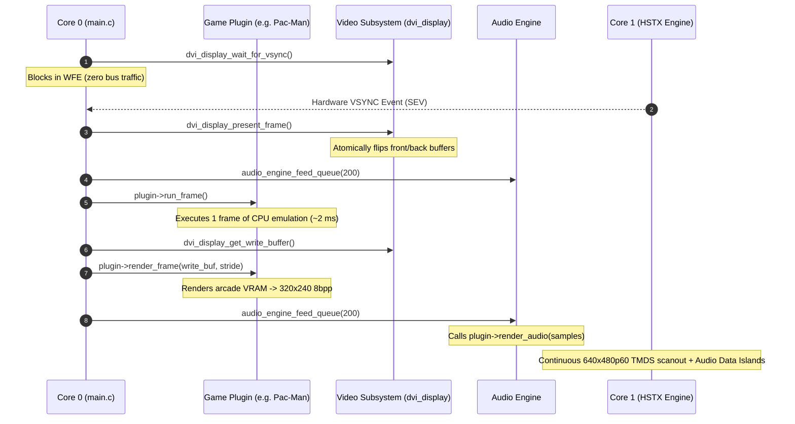

# HDMI & Video Subsystem API Reference

**RP2350 Hardware HSTX DVI/HDMI Host Platform Interface Specification (v1.4.0)**
**Version:** 1.4.0

---

## 1. Overview & Architectural Boundaries

This document specifies the **HDMI Video & Audio Host Subsystem API** for the Raspberry Pi Pico 2 (RP2350) modular arcade emulator platform.

> [!IMPORTANT]
> ### CRITICAL ARCHITECTURAL INVARIANT
> The video and audio transport subsystems (`src/video/`, `lib/pico_hdmi/`, `dvi_display.*`) represent **verified, fixed host platform infrastructure**.
> - **Never modify the video subsystem** when adding, modifying, or tuning game plugins.
> - Game plugins (`src/games/<game>/`) interface strictly through the clean plugin abstraction (`emulator_plugin_t` in `src/core/plugin_api.h`).
> - The host provides a double-buffered 320x240 8bpp canvas, 256-entry RGB888 palette management, and 48 kHz stereo PCM audio transport.

---

## 2. Hardware & Wire Specifications

| Parameter | Value / Specification | Notes |
|---|---|---|
| **Microcontroller** | Raspberry Pi Pico 2 (RP2350A, Cortex-M33) | 520 KB SRAM, Hardware HSTX peripheral |
| **System Clock (`clk_sys`)** | **151.200 MHz** (`DVI_SYS_CLK_KHZ 151200`) | Exact integer multiple (6x) of 25.200 MHz pixel clock |
| **Core Voltage (`VREG_VSEL`)** | **1.10 V** (`VREG_VOLTAGE_1_10`) | Default power-on voltage; clean signal edges |
| **Physical Output** | 640x480 @ 60.000 Hz (CEA-861 DVI/HDMI) | Pixel clock: 25.200 MHz, Line rate: 31.500 kHz |
| **Logical Framebuffer** | **320x240 8bpp indexed** (76.8 KB per buffer) | Double-buffered in SRAM (`fb_buffers[2]`) |
| **Color Depth** | 8-bit palettized $\to$ 24-bit RGB888 lookup $\to$ RGB565 TMDS | 256 palette entries; top 16 in Scratch X SRAM |
| **Audio Transport** | 48.000 kHz 16-bit Stereo LPCM | Injected as HDMI Data Island packets during H-blank |
| **HSTX Pinout** | D0: GP12/13, CK: GP14/15, D2: GP16/17, D1: GP18/19 | Hardware TMDS serialization on GPIO 12-19 |

---

## 3. Core Video API (`src/video/dvi_display.h`)

The core video interface manages system clocking, HSTX hardware bring-up, double-buffering, and hardware VSYNC synchronization.

### 3.1. Initialization & Core Management

```c
/**
 * @brief Sets the core voltage and system clock for the HDMI bit clock.
 * 
 * Must be invoked before `stdio_init_all()` to ensure the clock is stable
 * for USB/UART before standard libraries initialize.
 */
void dvi_display_clock_init(void);

/**
 * @brief Configures board HSTX pinout, timing, and brings up the pico_hdmi engine.
 * 
 * Initializes the compose ring buffer, registers the scanline callback,
 * initializes the Data Island queue, and sets the default 8-bit palette.
 */
void dvi_display_init(void);

/**
 * @brief Core 1 entry point for HSTX background tasks and scanout.
 * 
 * Launched by Core 0 via `multicore_launch_core1(core1_main)`.
 */
void core1_main(void);
```

### 3.2. Double-Buffering & Presentation

```c
/**
 * @brief Retrieves the 8bpp write buffer for the current frame.
 * 
 * Returns a pointer to an aligned 320x240 byte buffer in SRAM. Core 0 writes
 * exclusively to this buffer without racing Core 1's active scanout.
 * 
 * @return uint8_t* Pointer to 320x240 8bpp frame buffer.
 */
uint8_t *dvi_display_get_write_buffer(void);

/**
 * @brief Publishes the write buffer to Core 1 and reclaims the previous front buffer.
 * 
 * Executes a compiler memory barrier and atomically swaps the buffer indices.
 * Must be called once per frame from Core 0 during vertical blanking.
 */
void dvi_display_present_frame(void);
```

### 3.3. Synchronization & Genlock

```c
/**
 * @brief Blocks Core 0 in low-power standby until the next hardware VSYNC event.
 * 
 * Uses `__asm volatile("wfe")` to eliminate shared memory bus contention
 * while waiting for Core 1's DMA ISR to trigger the VSYNC event.
 * 
 * @param last_vfc Previous video frame count.
 * @return uint32_t New video frame count after VSYNC.
 */
uint32_t dvi_display_wait_for_vsync(uint32_t last_vfc);

/**
 * @brief Returns the raw hardware video frame count serviced by Core 1.
 * 
 * @return uint32_t Current hardware frame counter.
 */
uint32_t dvi_display_get_video_frame_count(void);
```

### 3.4. Palette Configuration

```c
/**
 * @brief Sets the 24-bit RGB888 color for an 8-bit palette index.
 * 
 * Converts RGB888 into packed dual-RGB565 words (`color | (color << 16)`).
 * Indices 0..15 are mirrored into `palette_fast` in Scratch X RAM to eliminate
 * shared SRAM bus contention during time-critical H-blank scanline fills.
 * 
 * @param index Palette index (0..255).
 * @param rgb888 Color in 0xRRGGBB format.
 */
void dvi_display_set_palette(uint8_t index, uint32_t rgb888);
```

---

## 4. Audio Host API (`src/platform/audio/audio_engine.h`)

Embedded HDMI audio is delivered via Data Island packets during horizontal blanking intervals.

```c
/**
 * @brief Initializes the host audio engine and mute state.
 */
void audio_engine_init(void);

/**
 * @brief Enables or disables audio output (e.g., muting during boot sync).
 * 
 * When muted, zero-amplitude silence packets are fed to maintain HDMI clock lock.
 * 
 * @param mute True to mute audio, false for active audio.
 */
void audio_engine_set_mute(bool mute);

/**
 * @brief Pre-fills the Data Island queue at boot before Core 1 launch.
 * 
 * @param target_level Target packet depth (typically 200 packets / 1 frame).
 */
void audio_engine_prefill_queue(uint32_t target_level);

/**
 * @brief Pulls audio from the active game plugin and pushes packets to HSTX.
 * 
 * Called multiple times across the frame loop to keep the queue topped up.
 * 
 * @param target_level Target queue depth (AUDIO_QUEUE_TARGET_LEVEL = 200).
 */
void audio_engine_feed_queue(uint32_t target_level);
```

---

## 5. Host Configuration Constants

`src/video/display_config.h`:

| Constant | Default | Description |
|---|---|---|
| `FRAME_WIDTH` | `320` | Logical framebuffer width in pixels |
| `FRAME_HEIGHT` | `240` | Logical framebuffer height in pixels |
| `DISPLAY_REFRESH_HZ` | `60` | Nominal display refresh rate in Hz |
| `BOOT_SYNC_FRAMES` | `60` | Black sync frames at boot for display clock acquisition (60 frames = 1.0s) |
| `DEBUG_TESTCARD` | `0` | Enable color-bar/grayscale test pattern (1=enable, 0=disable) |
| `DEBUG_TESTCARD_SECONDS` | `3` | Seconds to show the test card before handing off (0 = permanent) |
| `DEBUG_AUDIO_TEST_TONE` | `0` | Continuous 1 kHz sine wave diagnostic audio tone |

`src/platform/audio/audio_engine.h`:

| Constant | Default | Description |
|---|---|---|
| `AUDIO_SAMPLE_RATE` | `48000` | Embedded HDMI audio sample rate in Hz |
| `AUDIO_QUEUE_TARGET_LEVEL` | `200` | Target Data Island queue depth (200 packets = 800 samples = 1 frame) |

---

## 6. Plugin Interaction Contract (`src/core/plugin_api.h`)

Arcade games connect to the HDMI host platform via the `emulator_plugin_t` interface:



### Plugin Callback Requirements

1. **`init()`**: One-time startup initialization. Load ROMs, reset machine state.
2. **`load_palette()`**: Configure the host palette via `dvi_display_set_palette(index, rgb888)`.
3. **`run_frame()`**: Execute one 60 Hz frame worth of CPU and arcade hardware cycles.
4. **`render_frame(uint8_t *fb, uint32_t stride)`**: Draw the arcade display into the 320x240 8bpp write buffer.
5. **`render_audio(int16_t *buf, uint32_t sample_count)`**: Generate interleaved stereo 16-bit 48 kHz PCM samples.
6. **`update_inputs(uint32_t mask)`**: Process active digital controls (joystick, buttons, coin, start).

---

## 7. Performance & Stability Invariants

1. **Zero Dynamic Allocation**: All video buffers, compose ring templates, and queues are statically allocated with fixed SRAM addresses.
2. **Scratch X / Y Bus Partitioning**:
   - `line_buffer` is placed in **Scratch Y RAM** (`PICO_HDMI_LINE_BUFFER_IN_SCRATCH_Y`).
   - `palette_fast[16]` is placed in **Scratch X RAM** (`__scratch_x("palette_fast")`).
   - Eliminates bus contention between Core 0 and Core 1 during active H-blank scanout.
3. **Precomposed Active Lines**:
   - Static TMDS command headers are precomposed in `compose_ring` once at boot.
   - Core 1's scanline ISR execution time is reduced to `< 1.2 µs`, providing ample margin against the 6.35 µs H-blank deadline.
4. **Hardware Genlock**:
   - Emulation and buffer presentation are genlocked to hardware VSYNC (`video_frame_count`), preventing tearing and frame pacing jitter.
